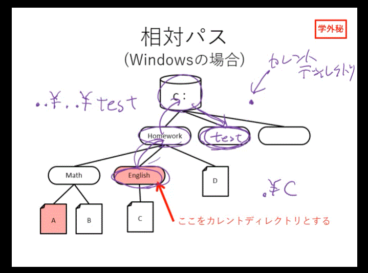

# 第 10 回　大切なデータを整理して保存する（１）

---

## 1.ファイルとセクタ、ブロック

- 特に外部記憶措置はハードディスクを想定する
- 大きなデータは連続したセクタに書き込むことが望ましい。
- OS ではセクタ単位ではなく、**クラスター**、つまりブロック単位で書き込む。
  

- 파일이 3섹터 분으로 이루어져 있는데, 하드디스크는 2블록 단위로 되어 있음. 그럼 파일을 저장하려면 2블록 분의 공간이 필요한데, 쓰고 남은 1섹터는 어찌 됨??
- OS でブロック単位を使う理由は**容量の効率より速度**を重視すること。
- ハードディスクような外部記憶措置は低速な装置が容量を大きくすることができる。つまり容量を犠牲しても速度を上げるという仕組み。なので、一旦ファイルの容量に合わせてブロックに保存する。では、空き空間はどうするのか？
  

- 그럼 파일을 저장하고 남은 공간은 어떻게 처리를 할 것인가? 아무리 공간을 희생하여 속도를 올린다고 해도, 반드시 남는 공간이 나온다.
- 정답은 남은 공간에 맞도록 다른 파일을 사이즈를 분할하여 빈공간에 넣게 된다. 아래 그림이 설명이 된다.
  
- これは CPU はできない。理由は CPU が主記憶装置に接続する時、タスクは必ず連続していなければならない、しかし外部装置はその必要はない。
- 그 이유는? 그 나누는 파일에 특정 정보를 붙임. 즉, 이 파일의 계속되는 부분이 어디에 있고, 몇 블록인지 에 대한 번호가 붙음.
- このように外部記憶装置は主記憶とは違って飛び地になったとしてもデータを分割して無駄なく利用する。

 -上のようにファイルが分離されて保存されることを**ファイルの断片化**と呼ぶ

- 파일의 단편화로 인해 파일에 액서스가 느려짐. 탐색 작업이 많아지기 때문에.
- 따라서 단편화 되어 분리되어 있는 블록을 파일이 연속해서 배치될수 있도록 정리하는 것이 **디플레그,デフラグ**라고 부름.(디스크 조각모음 같다...아마도)
- 디플래그 하면 하드디스크의 트랙은 아래와 같이 정리된다.
  

## 2.ファイルシステム（File System）

- 複数のファイルを効率的に管理するためのシステム

### 1)階層型ファイルシステム

- 폴더와 디렉토리는 동의어. OS시스템상에선 디렉토리라고 불러야 한다.
- 디렉토리 트리(Directory tree)의 개요.
  
- 아래와 같이 한 열이 하나의 층을 구성하고 있기 때문에 계층형 파일 시스템이라고 부른다. 
- 아래 처럼 보면, 나무 같다. 가장 아래의 부분을 뿌리부분, 즉 그래서 루트디렉토리라고 부르는 것이다.
  
- 계층파일 시스템은 현재 가장 많이 사용되는 시스템의 일종이다.

### 2)各 OS のファイルシステム

- ファイルシステムの種類はなぜ多いのか、それはどんどんバージョンアップしたから。
- 
- 윈도우, 맥, 리눅스 시스템의 파일 시스템은 전혀 달라서 호환성은 없다. コンパチビリティはない。그러나 USB로 파일을 옮기거나 할수 있다 그것은 어째서 인가???
- OS によって FAT がまったく違う。
- 理由は、たとえば共通の FAT32 ファイルシステムが各自の OS で存在して使えるようになる。では、なぜそれが共通に存在するか。
  
- MS が開発した FAT システムが非常に単純でコストが安かった。
- 業界標準になってします。
- デジタル機器によく利用されたので、MA ｃもＬｉｎｕｘもＦＡＴシステムを入れるようになる。

### 3)フォーマット（初期化）

- 形式を外部記憶装置の中に書き込む、FAT にあたる情報を各 OS ごとに書き込む。形式は OS ごとに採用しているブロックとファイルの関係を表した情報（FAT）を書き込む。
- partition? 만약 니가 하나의 하드디스크에 윈도우 용 공간과 맥용 공간을 따로 설정하고 싶다고 치자. 그러면 다루는 파일 형식에 맞춰서 FAT가 각각 다르게 포맷을 진행해야 할 필요가 있다. 포맷의 구분을 구분짓는 것이 필요, 논리적으로 구분을 하는 것이 파티션이다.
-

### 4)ファイルパス（FilePath）

- ファイルがどこにあるという情報、どんなふうに書くのか。道筋
  

- 絶対パスはルートディレクトリが基になる。相対パスはたくさんあるディレクトリの中でどこを基準にして道筋を表す。
  
- Windows は伝統的に各外部記憶装置にルートがある。C,D,E 　のようにドライブレターという文字がつけられる。
- 왠지 절대패스 상대패스 쓰는 문제 나올듯 ㅋㅋ
  
- 위처럼 루트로부터 시작해 구분자 \ 를 이용해 표시하는 것이 절대패스의 표기법.
- 맥이나 리눅스는 /를 이용하니 주의. 그리고 처음부터 /가 붙는다. 윈도우처럼 루트를 쓰지는 않음.

### 5)カレントディレクトリ(Current Directory)

- 現在、タスクが使用しているディレクトリ
- 現在、作業中のディレクトリ、つまりアプリケーションが自分が作業をしてるディレクトリを知るためのパス。
  
- 현재 패스에서 다른 디렉토리에 있는 파일로 찾아가는 길. 표현 방식은 피리오드, .을 이용한다.
- 예를 들어 현재의 영어 폴더에서 수학폴더의 A자료에 찾아간다면,
- ../Math/a 가 될것이다
- ..은 바로 위 디렉토리를 가리킨다. 이건 좀더 공부해야 할듯. 시험에 나온다. 헷갈린다.
- .은 현재의 디렉토리를 가리킨다. ./Homework/Math/a
