# 第 12 回　大切なデータを整理して保存する（２）

---

## ファイルとデータ
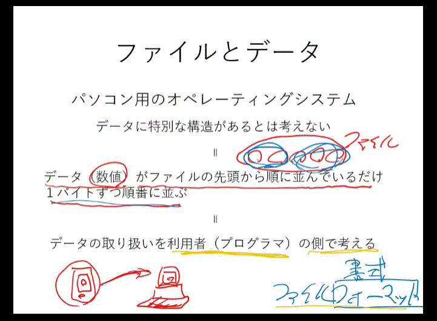
1. パソコン用の OS ではいわゆるファイルフォーマットというのはプログラマー側でアプリケーションを作る時にきちんと決めること。
2. OS 自体には特別な構造は考えていない。もし特別な形式で写真をとってパソコンに移動させても、そのフォーマットを扱うアプリケーションが無ければただのデータに過ぎない。

### 1.テキストファイルとバイバリーファイル

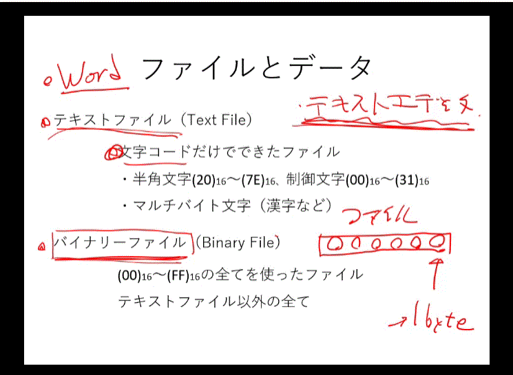

1. テキストファイル　-　文字コードだけの構成
2. 文字コードを使って、人間が読むことができるかどうかが大きな違い
3. ワードの場合は入力する文字はテキスト、文字入力以外のデータはバイナリー

### 2.大型汎用機用の OS のファイル構造は？

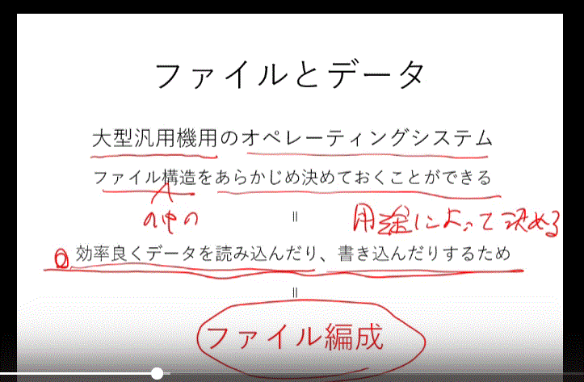
教科書 71

### 3.データの並びを決めることって何か？

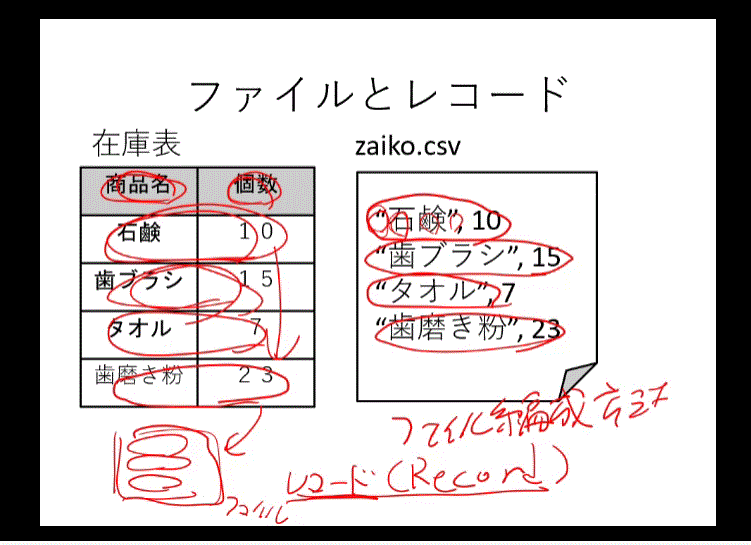

1. 大型汎用機はファイルを 1 バイトづつデータとして考えることではなく、レコードという形式で
   ファイルの中にどのように片づけるのかを考える、その方法をファイル編成と呼ぶ。大型汎用機はこの三つの方法を被ることで効率よく大量のデータを扱うことができる。

### 4. ファイル編成方法

1.  順編成ファイル
    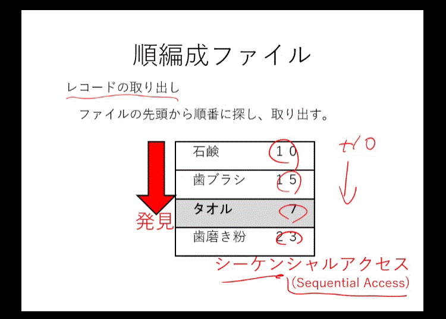

    1. レコードをただ順番に並べた方法。シーケンシャルアクセス方法はデータを探すのはあまり向いていない。 順番通りにレコードを全て読み込まなければならない。ただ、大量のデータを先頭から順番に処理を掛けるという目的には合う。HDD のトラックの回転に合わせて順番に書けるので高速に記録処理ができる。
       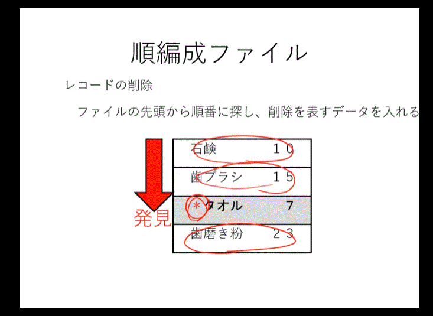
    2. 削除の場合には削除マークを付けて処理。順番通りに先頭から読み取って、削除マークがついている部分は飛ばして次を読み込む。
       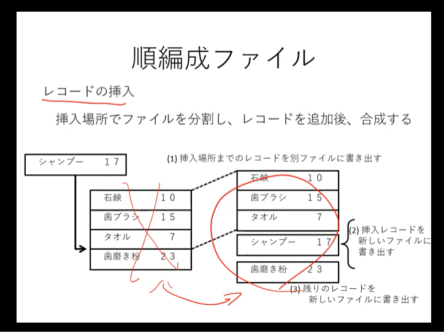
    3. 새로운 레코드의 삽입은? 먼저 삽입 위치의 앞부분의 레코드들을 별도의 파일로 분리,
       새로운 레코드를 삽입, 남은 레코드를 뒤에 다시 늘어놓음. 낡은 파일은 삭제하고, 새로운 파일을 남기는 구조.
       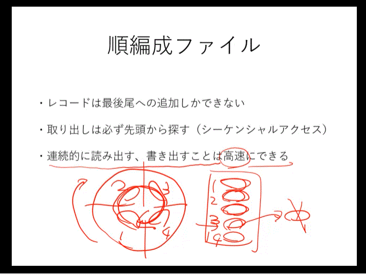
    4. 大量のデータを順番通りに書き込んだりする際に非常に高速。

2.  索引順編成ファイル（ランダムアクセス）
    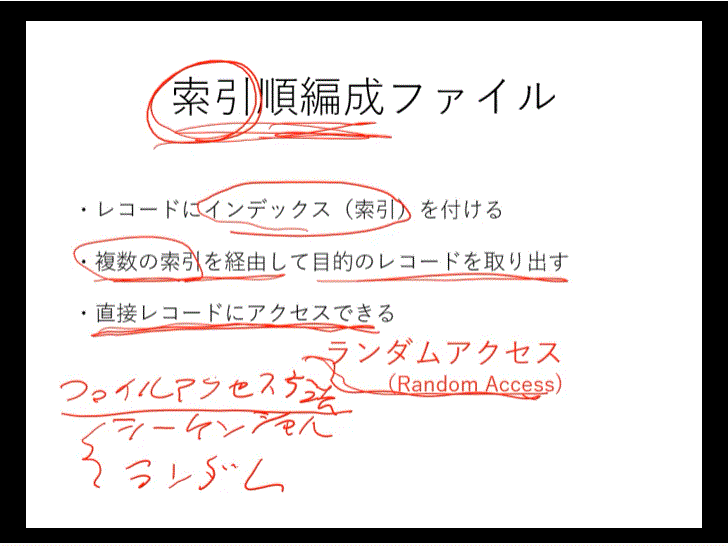

    1. 辞書のようにレコードに索引を付けてデータを探し出す。シーケンシャルアクセスとこのランダムアクセスはレコードやデータの取り出し方ついての名前。つまり、**ファイルアクセス方法**だ。二つの中でどれを使うのかはプログラマの判断、しかも大型汎用機には二つの方法を被ることができる。
       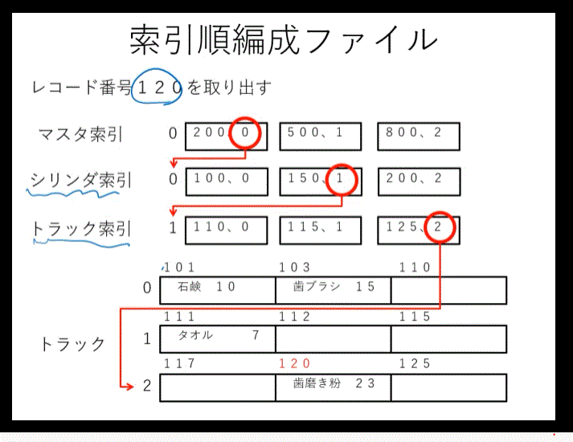
    2. 위의 설명. 레코드 넘버 120번의 자료를 찾아라 는, 먼저 마스터색인의 200, 500, 800은 각각 0번을 참조, 1번을 참조, 2번을 참조 하라고 오른쪽에 색인 번호가 쓰여져 있다. 의미는 200번까지는 다음 실린더색인에서 0번을 참조, 200번에서 500번까지는 1번을 참조, 500번에서 800번까지는 2번을 참조하라는 뜻.
       실린더 색인으로 넘어가서, 100번에서 150번까지를 참조하기 위해 150번 색인을 보면, 트랙색인의 1번을 참조하라고 표시되어 있다. 따라서, 트랙 색인의 1번으로 가면, 해당하는 125번의 레코드를 찾을수 있는데, 이때 레코드 색인에는 2번 트랙으로 가라고 역시 색인이 남겨져 있다. 트랙의 내부는 준편성으로 되어 있는 점을 기억하자. 따라서 2번 트랙의 처음부터 검색하여 해당하는 레코드를 찾아낸다. 색인준편성파일은 이처럼 색인 과 준편성을 같이 이용하여 파일을 찾아낸다.

3.  直接編成ファイル

    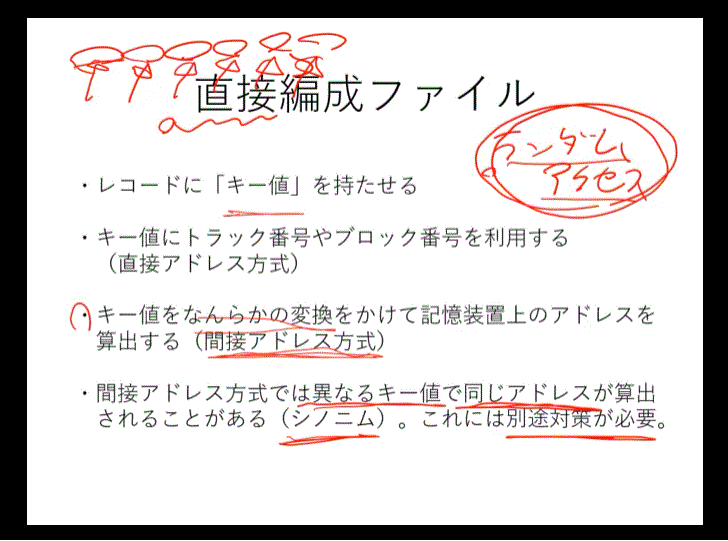

    1. 基本的にはランダムアクセス。レコード番号とは違うキー値を与える。
    2. うまくキー値を扱う仕組みがあれば、レコードにすぐアクセスができる。順編成ファイルの場合はそもそもデータがトラックやセクターを連続するようにレコードが流れているが、直接編成はランダムアクセス方式を利用しているので、順番にランダムアクセスをすればシーケンシャルアクセスのように先頭から順番にアクセスができるがそのたびにキー値を確認しなければならないので非常に効率悪い。なので、探して書き込むという仕組みにはいい方式。
