# 第 13 入出力を高速化する

---

カーネルの입출력관리부분에 해당함.

## 1.入出力を高速化するためのハードウェア

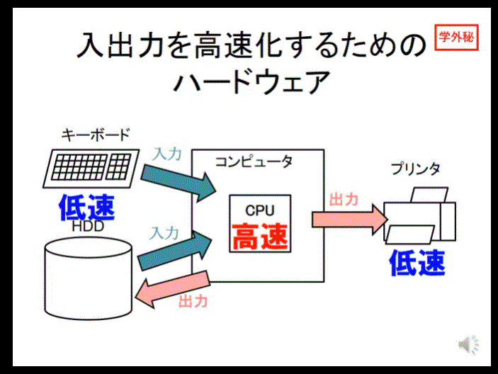
컴퓨터 주변의 입출력장치는 시피유에 비교하면 아주 느림. 따라서 이것들을 시피유가 하나하나 제어하다보면, 시피유는 일명 대기시간때문에 작업을 원할히 진행할수가 업음.
最近は CPU に対して低速になっている周辺装置の高速化に工夫している。
では、その工夫とは？

---

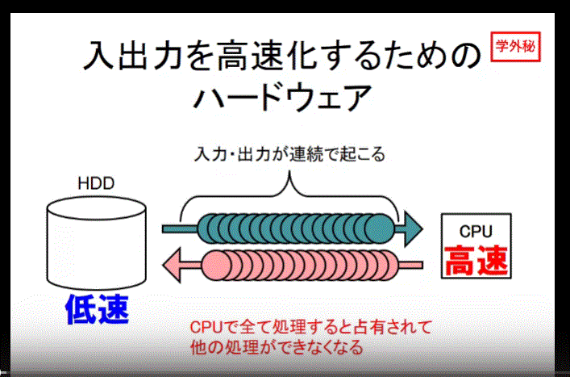
HDD와 시피유의 작용을 예를 들어보자.
입력 출력을 위해 하드디스크는 대량의 데이터를 시피유에 연속해서 보낸다. 그것은 시피유의 처리를 점유하여 다른 처리를 하지 못하도록 한다. 왜냐하면, 시피유는 한번에 하나의 처리밖에 진행을 못하기 때문이다.

---

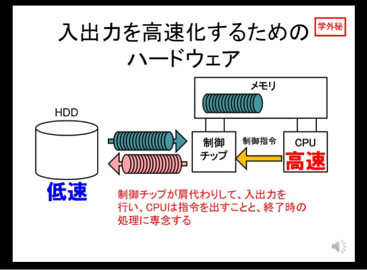
이번에는 어떠한가, 시피유와 하드디스크는 직접적으로 연결되어 있지 않다.
본래는 시피유가 하드디스크의 입출력을 처리해야 하지만, **제어칩** 이라는 존재에 의해, 그 처리를 맡기고, 시피유는 제어칩에 제어지령을 내린다. 즉, 제어칩이 대신해서 입출력을 처리하는 것이다. 즉, 입출력에 관해서 시피유 대신 처리를 하는 다른 시피유라고 생각하자.
시피유는 이로 인해 입출력시 제어칩에 명령을 내리는 것과 종료시의 처리만 태스크를 부여할수 있다.

---

## 2.OS による入出力の効率化、その仕組み

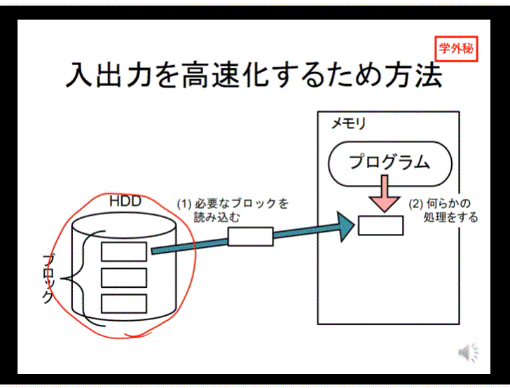

위의 설명. 하드디스크에 파일이 블록단위로 나뉘어져있다. 한 블록을 메모리에 읽어들인후, 프로그램이 처리를 진행한다. 이 과정을 전 블록대상으로 진행. 단 블록단위로 읽어들여서 그때그때 처리를 진행하는 것에는 어떠한 문제가 발생한다.

---

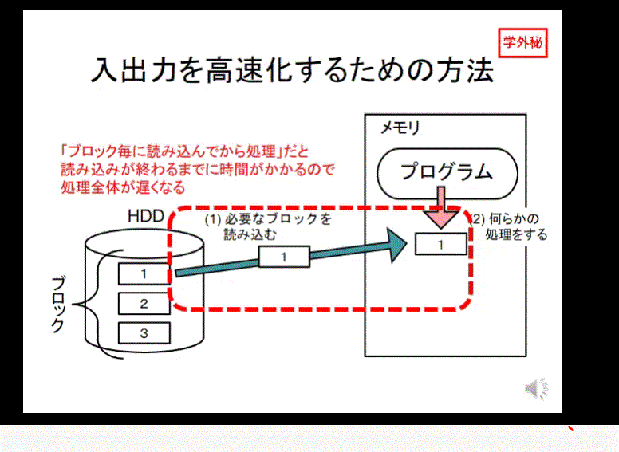

프로그램으로부터 한 블록을 읽어들여 처리하는 구조이지만, 이 읽어들이는 과정이 끝나기 전에는 즉 읽어들이는 도중에는 메모리상의 프로그램은 어떠한 처리도 할수 없는 상태가 된다.
**1번과정, 즉 읽어들이는 시간의 고속화가 필요한 것이다.**
이것을 위해 다음과 같은 처리가 진행이 된다.

---

1. 버퍼(하드에 읽어들일 때)
   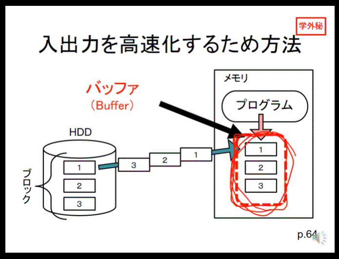
   가령 불러들여야할 파일이 블록단위로 나뉘어져 있고, 그것이 하드디스크상에 연속해서 있다고 가정하자. _블록이 연속되어 있으면 읽어들이는 건 상당히 고속으로 할수가 있다._
   즉, 블록 하나씩 읽어들여서 하나의 처리가 끝나면 다음 블록을 읽어들여서 처리를 진행....하는 답답한 과정이 아닌, 블록이 연속되어 있기 때문에 필요한 블록들을 한꺼번에 묶어서 메모리에 전달하고 메모리상에서 바로바로 프로그램이 처리하게 하는 방식.
   **필요한 부분을 쌓아두고 사용하는 이 기술을 버퍼　バッファ, 파일에 사용되는 것은 파일버퍼 ファイルバッファ라고 한다.**

2. 버퍼(하드에 써넣을 때)
   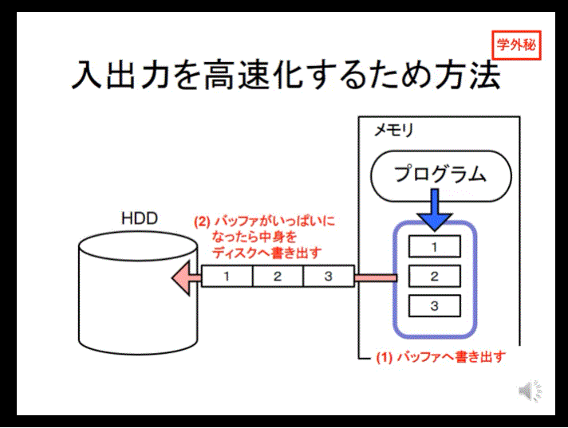
   읽어들일때와 마찬가지로 1블록씩 하면 시간낭비가 된다. 따라서, 메모리에 있는 파일버퍼를 활용한다. OS는 파일의 쓰기 명령이 오면, 메모리의 파일버퍼에 그 내용을 써넣는다. **이때 활용되는 파일버퍼는 메모리상에 존재하기 때문에 쓰기로 인한 대기시간이 거의 존재하지 않는다.** 그럼 이 메모리상의 파일버퍼에 써진 데이터는 언제 하드디스크로 가는 가? OS가 타이밍을 보고 결정한다. 그중 한가지가 파일버퍼도 용량의 한계가 있기 때문에**버퍼가 가득 차면 디스크로 쓰기 작업을 하게 된다.**

---

3. 이전의 데이터를 다시 재이용하고 싶을때는? 캐시
   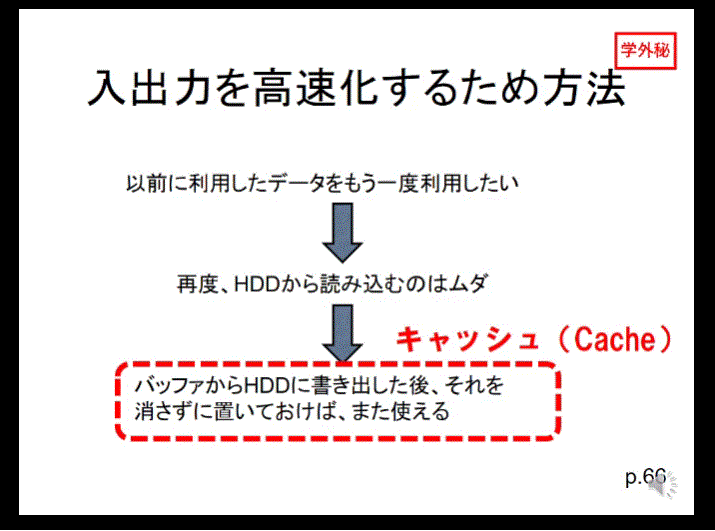
   쓰기작업을 완료하고 어떤 예비된 공간에 버퍼를 남겨놓아서 나중에 재이용을 하는 것을 **캐시キャッシュ** 버퍼에 남겨진 블록 데이터는 이용가치가 상당히 높아진다. 왜냐면 다시 버퍼를 만들고 다시 하드디스크로부터 읽어들이는 작업을 하지 않아도 되니까.

이처럼 버퍼와 캐시를 동시에 이용하는 것을 캐시버퍼라고 부르기도 한다.

---

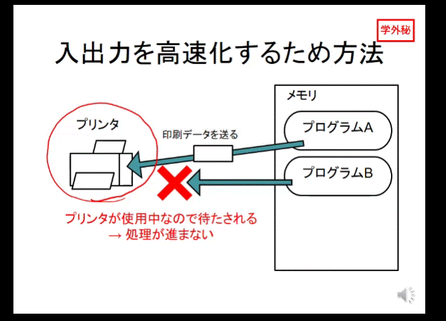
프린터를 사용한다고 가정했을때, 프린터는 출력처리가 상당히 느린 기기이다.
메모리의 프로그램이 몇갠가 존재하여, 그 프로그램이 전부 프린터를 사용해야 하는 상황이라면, 어쩔수없이 **대기시간이 발생한다.** 이것을 어떻게 없애야 할까?

---

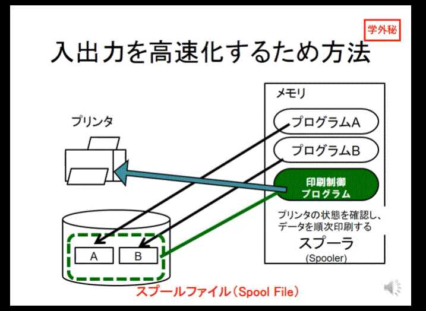
인쇄제어프로그램을 메모리 상에 준비, 그 프로그램에 출력에 관한 인쇄데이터를 전달하면, 그 프로그램은 그것을 프린터에 바로 전달하는 것이 아닌 외부기억장치에 그것을 저장한다.
외부기억장치의 속도는 프린터와 비교하면 압도적으로 빠르다. 한편, 인쇄제어프로그램은 외부기억장치에 인쇄데이터를 저장후, 지시를 내린 프로그램A에 종료를 선언. 그로인해 프로그램은 다음 태스크의 실행으로 넘어가게 된다. 한편, 인쇄데이터가 외부기억장치에 저장된 장소를 가리켜 **스풀파일 スプールファイル**이라고한다.
위의 과정을 보면, 처리완료라고 프로그램에 보고되긴 하지만, 인쇄 데이터는 그냥 외부기억장치에 저장된 상태일 뿐이다. **인쇄제어프로그램은 상황을 보고 판단하여 외부기억장치에 저장된 이 인쇄데이터를 순번대로 프린터에 전달하게 된다.**
이처럼, 인쇄데이터는 외부의 기억장치에 저장하여 순번대로 처리하고, 인쇄를 요구하는 프로그램에는 인쇄가 금방 끝난것처럼 보이게 하는 이 과정을 **프린터스풀러プリンタスプーら**이라고 한다.
인쇄제어프로그램이 인쇄데이터를 외부기억장치에 보존하는 것을 **스풀링スプーリング**이라고 한다.
**될수있는대로 메모리상의 태스크를 원할하게 하여 속도를 보충하기 위한 체계**

---

4. 트레이드오프
   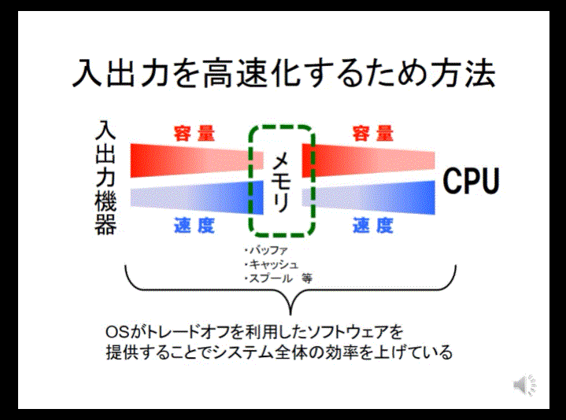
   본래 사용하기 위한 장치보다 처리가 빠른 장치를 중간에 배치하여 버퍼, 캐시, 스풀같은 고속화 기술을 사용할수 있게 된다. OS는 어플리케이션이 의식하지 않아도 파일의 입출력을 이용하여 버퍼나, 캐시등을 사용하여 속도를 높이는 이런 체계.
   즉, **OS가 트레이트오프를 이용한 소프트웨어를 제공하는 것으로 인해 시스템의 전제적인 효율을 올리는 방법**
   입출력관리 부분에서는 이 트레이드오프를 잘 이용한 버퍼 캐시 스풀같은 고속화기술이 사용되고 있다.(이 세가지 외워둘것)
