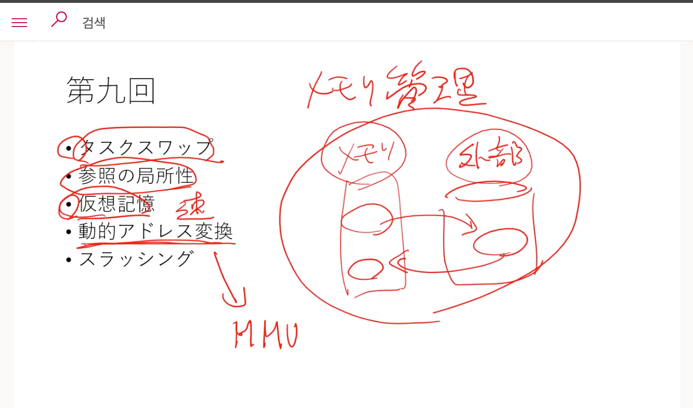
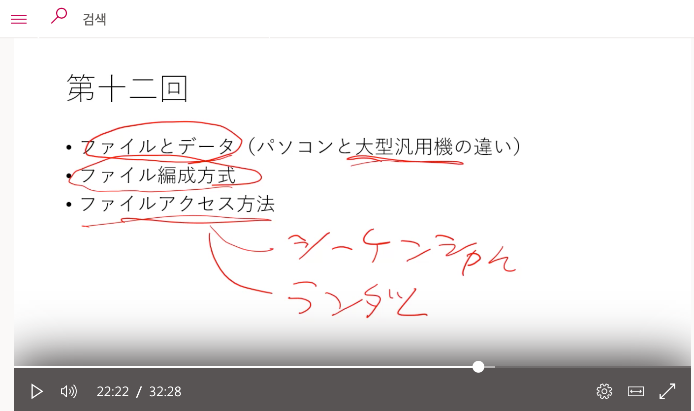

# 第14回　今までの振り返り

## 第1回

1. オペレーティングシステムの目的
   1. 使いやすい環境を整えるため
   2. それがAPI
2. オペレーティングシステムを中心としたハードウェア、アプリケーションソフトとの関係
   1. **オペレーションシステムはハードウェアとアプリケーションを仲介する。**
3. オペレーティングシステムの構造
   1. ー配ったプリントを参考ー

## 第2回

1. メモリの構造
   1. メモリはアドレスを使ってデータを保存、読み込む
2. CPUの構造と動作
   1. 命令ポイントに関するしっかりとした理解
3. CPUとメモリの関係
   1. バスの理解が必要。どの関係なのか
4. ディスク装置の構造
   1. データを永続保存する場所

## 第3回

1. コンピュータ起動の流れ
   1.Bootstrapに関する理解が必要
2. アプリケーションの起動
   1. タスクの話ー実行中と実行可能、入力待機の違い点
   2. メモリの中で読み込んで実行するという仕組みについて
3. 割り込みとは
   1. どのようにして割り込みが実現されているのか

## 第4回
커넬의 다섯가지 관리 기능(태스크관리, 메모리관리, 파일관리, 입출력관리, 통신관리) 중에서 태스크 관리에 해당(5회까지)

1. 連続実行と同時実行
   1.コンピュータの仕事をさせるにはどの仕組みがあるのか？
2. スケジューラとは？
3. マルチタスクとは？
   1. 連続事項を担当するスケジューラに同時実行が含まれてマルチタスクになった
## 第5回

1. ノンプリエンプティブとプリエンプティブとは？
2. タスクスケジューリングアルゴリズム
   1. 第6回の授業をもう一度見よう
3. タスクの種類
4. 優先度
5. プルセステーブル
   1. 優先度の順序を決めるのがプロセステーブル。このプロセステーブルによって次に実行すべきのタスクを選ぶ。
6. タスクの状態
   1. タスクの４つの状態について
7. マルチスレッド
8. マルチプロセッサ

## 第6回をもう一度見る必要がある
## 第8回

1. 物理メモリ
   1. 無駄をなくす技術はなに？
   2. メモリのなかだけで無駄を起こさない技術
2. セグメント
3. オーバーレイ
4. メモリの断片化
5. リエントランと
6. リンク

## 第9回

태스크스와프와 가상기억은 메모리의 안에서 지금 사용하고 있는 이외의 장소는 지금 필요없으니 주기억장치로부터  외부기억장치에 정리해두자 그리고 필요해지면 불러오자 라는 개념
1. タスクスワップ
2. 参照の局所性
3. 仮想記憶
4. 動的アドレス変換
   1. 가상 기억을 실현하려면 동적어드레스 변환이 필요하다. 최근에는 mmu 라는 부품이 시피유에 포함되어 도와준다.
5. スラッシング

## 第10回

1. ファイル、ブロック、セクタ
   1. ブロック単位で使うと比較的にファイルを使いやすくなる。でもファイルの断片化問題を起こす
2. ファイルの断片化
3. 階層型ファイルシステム
4. フォーマットとパーティション
5. 絶対パスと相対パスを合わせてファイルパス、カレントディレクトリ

## 第1２回

1. ファイルとデータ（パソコンと大型汎用機の違い）
2. ファイル編成方法
3. ファイルアクセス方法
   1. シーケンシャルアクセス
   2. ランダムアクセス

## 第13回
입출력관리에 해당
1. バップァ
2. キャッシュ
3. スプール
   1. 送信するべきのデータを一旦整えて送信先が準備されたら送信する