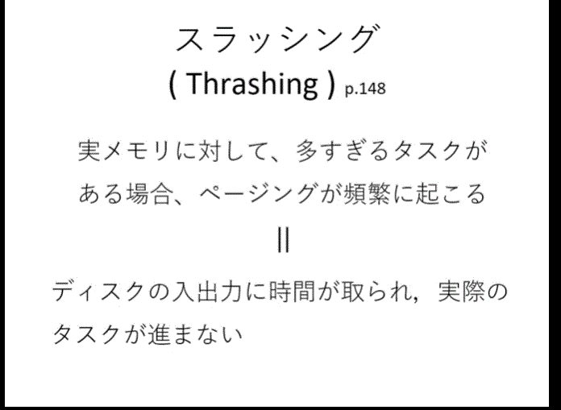

# 第 9 回目　限られたメモリを効率よく使うには（２）

---

## タスクを追い出す

- もしメモリの中がタスクたちでいっぱいになったら？
  - 一般にはタスクたちの中で未使用の一つを外部記憶措置へ追い出す方法（なぜならタスクは結局一つしか使われないので必ず空き時間が出る、その中で一番使わってないタスクを追い出す）
  - 後、その空き部分に他のあたらしいタスクを入れる
    
  - タスクスワップ（Task Swap のために外部記憶措置にある場所を、つまりタスクを片づけるためのスワップ領域を設ける。スワッピングと呼ぶ
    
  - スワップアウトとスワップイン
  - これによってメモリが少なくてもたくさんのタスクを使えると見えるが問題がある
  - タスク全体をスワップするには、処理に時間がかかる。
    - 数ギガナイトのプログラムをスワップアウトとスワップイントしようとするとかなり時間がかかる。結局、処理の効率が下がる問題、現代の OS ではこれをそのままつかうことはない

## 参照の局所性

- スワッピングは容量は補うことはできても速度が問題
- 主記憶メモリの中で一定の時間内で実行される命令は、ごく一部に限られる。
  

## 仮想記憶（Virtual Memory）

- タスクスワップの欠点を補う、三署の局所性を医療する方法。
- まず、メモリの中を内容に関係なく一定の**ページ**に区切って分ける。

  - 
  - **ページング方式仮想記憶**：外部記憶措置の中に**ページファイル**というページを片づける場所を設ける。そのページファイルの中にタスク単位ではなく、ページ単位で不要な部分を片づける
  - 大きな違いはタスク単位（大きな単位）ではなく小さく区切ったページ単位で片づけたり、またメモリの中に呼び出したりする。これをページアウト、ページインというページング方式と呼ぶ　スワッピングに比べたら非常に速い
  - 페이징은 프로세스를 일정크기인 페이지로 잘라서 메모리에 적재후, 그것을 하드디스크에 마련한 별도의 페이징파일에 보관
  - 이걸로 인해 태스크가 메모리의 사이즈를 넘어서도 운용이 가능하게 해 준다.
    
  - **メモリスケジューリング**

    - LRU 法
      - 最近 使われていないページを追い出す。あまり利用されていないタスクを色くすることで選ぶ
      - 가상메모리는 실 메모리의 한계를 넘어서 큰 메모리가 존재하는 것처럼 보이게 해준다.

  - 仮想メモリを三つの部分に分けると
    
    - 페이지 테이블은 가상기억의 페이지를 관리하기 위한 정보가 쓰여져 있다.
      - 왼쪽의 위치는 가상 메모리의 위치, 오른쪽의 괄호 안의 숫자는 실제 메모리의 주소. O,X는 실제로 실 매모리에 존재하는가의 여부.
      - 어플리케이션 측에서 볼때는 메모리가 가상 메모리의 형태로 보임. 페이지 테이블을 참조함으로 인해, 현재 엑서스 하려고 하는 가상 메모리 상의 주소가 2번이라고 하면, CPU는 페이지테이블에서 명령의 실메모리 주소를 확인하여 접근하게 된다. 즉 2번-> 페이지테이블에서 확인..실메모리에는 3번이라고 기록 -> 실메모리의 3번으로 접근. 이렇게 함으로서 어플리케이션이 가상메모리상의 주소에 접근해도 실메모리의 올바른 주소로 다시 접근이 가능해진다. 이것이 가상메모리의 작동방식이다.
  - 仮想メモリ上のアドレスと実メモリ上のアドレスを相互変換する仕組み
    - DAT 動的アドレス変換 : ソフトウェアだけでなく CPU にこのアドレス変換用の部品を組み込むことが一般（MMU が入る）
  - 仮想メモリは、ユーザーは実メモリを直接扱わない　＝　システムの安全性を高めることにも役に立つ。アドレス変換という仕組みは、変換をする際に、**そのアドレスに今アクセスしてもいいのかを確認し、不必要なアクセスを防ぐ役割もする** これによってシステムの安全性が高まる

## スラッシング（Thrashing）

- 仮想記憶技術の弱点
- 実メモリに対して、多すぎるタスクがある場合、ページングが頻繁に発生。
- それで、ディスクの入出力に時間がとられ、実際のタスクが進まない。
- 과도하게 페이징이 발생하는 것을 의미. 이것으로 인해 cpu의 이용률이 높아져서 스레싱이 발생함. 메모리상에 상주하는 프로그램이 늘수록 가능성이 증가. 컴퓨터는 느려진다.
  결국, 메모리를 확장하는 , 돈을 써서 부품을 늘리는 방법 뿐.
  SSD는 페이징 속도가 HDD에 비해 비약적으로 높기때문에 스레싱의 위험이 적다.
