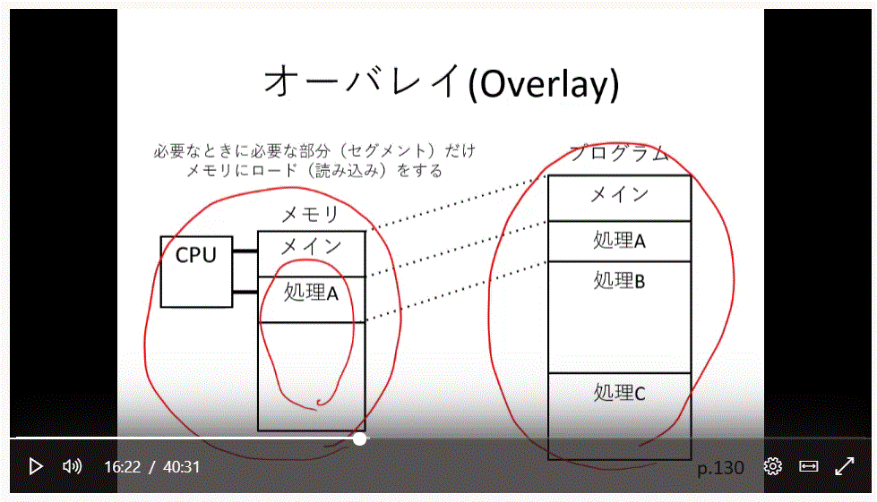
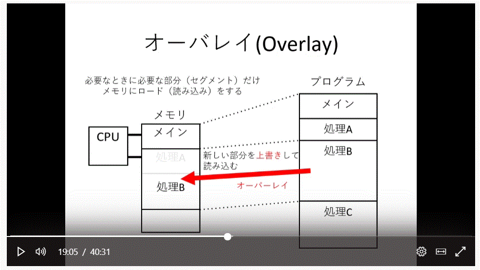
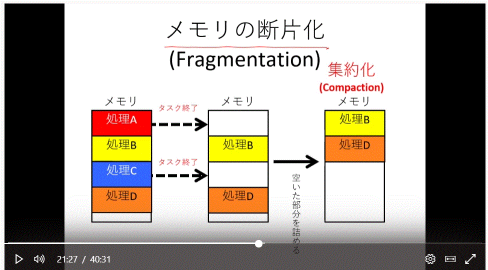
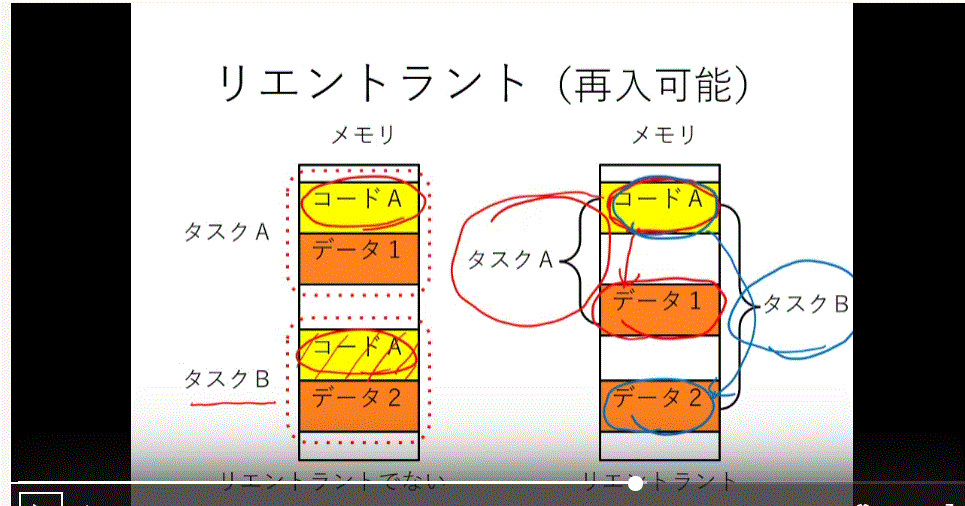
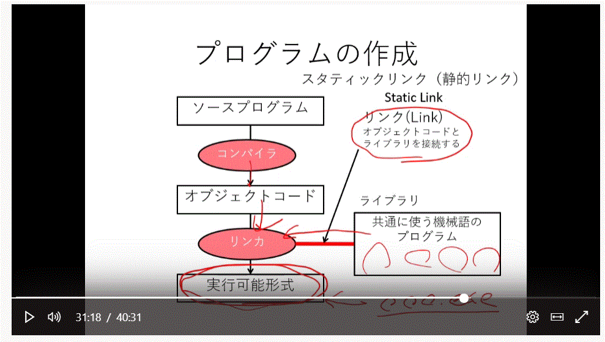
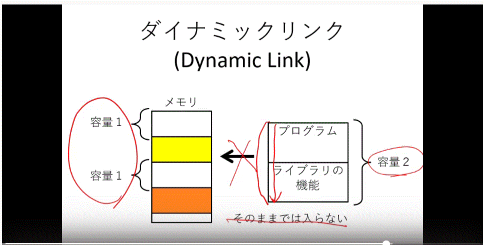
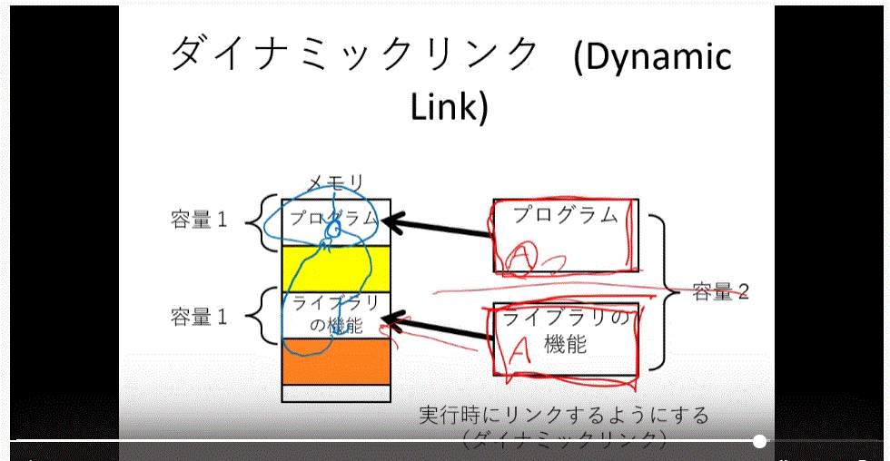
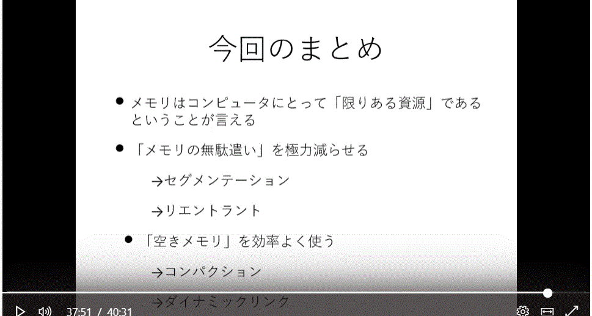

# 第 8 回目　限られたメモリを効率よく使うには？(1)

---

- この部分はカーネルの中のメモリ管理部分にあたる内容だ

1. 物理的なメモリの限界
   - 次回からは CPU とメモリとは違う仮想メモリについて話す
   - 物理メモリは言葉通り、仮想メモリは物理と同じく主記憶装置として扱えること
   - 限界？
     - アドレスバスの本数によって扱えるメモリ容量の限界が発生
     - アドレスバスが多い CPU や大きな容量のメモリの購入ー＞金額の問題発生、メモリの大きさによってその限界が発生
     - 現在のソフトの昔との違いは使いやすさ、それのために色んな機能を入れると容量は上がる。つまり、機能の発展に従ってメモリの容量の発展も上がった。
     - しかし、いくらメモリが発展してもプログラムが要求するメモリ量も上がるのでいつも足りないかも。
     - OS としてはこの問題を解決するためにメモリの管理機能が必要
2. セグメント（segment)
   
   - プルグラムを処理単位で分けておいたこと。
   - プルグラムは機能別に分けていることが通常、よって機能単位で分割して考えることが **セグメンテーション**, 区切られたプログラムを**セグメント**と呼ぶ
3. Overlay オーバーレイ
   

   - もしセグメントが一つの大きなプログラムになっていたらメモリの容量が違うとそれを全部読み込むことはできない。
   - セグメントを使うと上必要な部分を入れて実行することができるが、残りのメモリが少なかったらどうしよう？

   

   - プログラムの実行に必須的なメインプログラムは除いて、必要な部分を上書きして読み込む、つまり A があった場所に B のプログラムを上書きして実行させる、これが**オーバーレイ**。
   - 何らかの操作や処理にあたって今必要されない部分に必要な部分、つまりセグメントで区切られた物を上書きする。
   - これの意義はメインメモリより大きなプルグラムをこの方法によって実行させること。

4. メモリの断片化(pregmentation)
   

   - CPU の作動方式に戻ろう。CPU は一つのメモリアドレスの命令を連続的に取り出すが、もしメモリの中が整理されなく、セグメントたちがばらばらになっていると次のセグメントを入れる容量もたりなくなる。なのでメモリの中で残ったものを詰めて容量を確保する技術。

5. りエントラント（再入可能）
    -同じプログラムをメモリの中で複数動くならプログラムを保存する場所は一つにしておいて、そのプログラムが使うデータらを一つずつ組み合わせでタスクにしておく
   - 同じプログラムで大量の異なったデータを使う時に有効
6. プログラムの作成
    -プログラムを作成する時に何度も繰り返して実行する部分があって、それを部品化してライブラリと呼ぶ。

   - ライブラリと作成してコンパイルしたオブジェクトコードとリンクを合わせることがリンカ。
   - リンカは実行可能性式、いわば \*.exe 　みたいなファイル形式。
   - オブジェクトコードとライブラリをくっつけることで実行可能形式になることをスタティックリンクと呼ぶ。

7. ダイナミックリンク
   
   - メモリの中を整理してリンクが入れる状態にするコンパクションもあるが、それはわざわざ移動させることでプログラムが実行させるので速度が下がる。
   - しかも、容量の問題でプログラムとライブラリをくっつけたままでメモリに入れない状態になることもある。
      -それで、プログラムとライブラリを分けて各自メモリの中で入れて、プログラムがライブラリを必要としたら探していく、つまり実行の時にリンクをする。**最初から肯定的にリンクされずに（静的リンク）必要に応じてリンクをする（動的リンク）**
     - ダイナミックリンクはメモリが連続的になっていない時に有効し、プログラムのバージョンアップする時にわざわざコンパイルをやり直さなくてもライブラリだけを取り替えることで便利になる
8. まとめ
   

- CPU のアドレスバスによって統制できる容量の限界、コストの問題による限り
- メモリの無駄使い亡くすこと -必要なプログラムだけをメモリに読み込むこと、セグメンテーション -異なるデータを同じプログラムで複数の処理をするときにはプログラムだけを共有する仕組みをりエントラント
