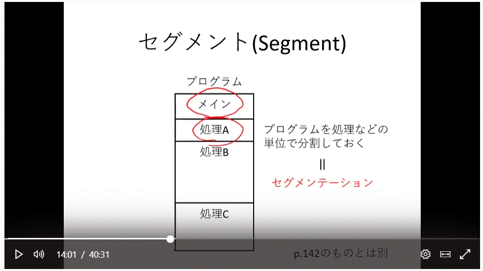

# 第 8 回目　限られたメモリを効率よく使うには？(1)

---

- この部分はカーネルの中のメモリ管理部分にあたる内容だ

1. 物理的なメモリの限界
   - 次回からは CPU とメモリとは違う仮想メモリについて話す
   - 物理メモリは言葉通り、仮想メモリは物理と同じく主記憶装置として扱えること
   - 限界？
     - アドレスバスの本数によって扱えるメモリ容量の限界が発生
     - アドレスバスが多い CPU や大きな容量のメモリの購入ー＞金額の問題発生、メモリの大きさによってその限界が発生
     - 現在のソフトの昔との違いは使いやすさ、それのために色んな機能を入れると容量は上がる。つまり、機能の発展に従ってメモリの容量の発展も上がった。
     - しかし、いくらメモリが発展してもプログラムが要求するメモリ量も上がるのでいつも足りないかも。
     - OS としてはこの問題を解決するためにメモリの管理機能が必要
2. セグメント（segment)
   
